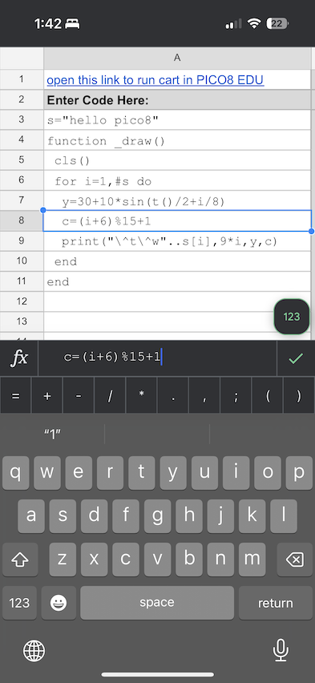

## SpreadSheet -> PICO-8 Education Edition

A way to create simple games / animations in PICO-8 on your phone, when not near a computer.

**(add animation or table of images here)**

I'll admit, this is a strange solution to an extremely niche problem. I just built it for myself, but am sharing it here for the handful of other people in the world this would be interesting to... everything below will assume you're already experienced with PICO-8 development on a computer.

Do you enjoy the cozy development system [PICO-8]([url](https://www.lexaloffle.com/pico-8.php)), a 'fantasy console' you can use to make 16-color 128-pixel games and art? But do you wish you had a way to create and edit programs on mobile?

There's no official Android/iOS app yet, and the free [web-based PICO-8 Education Edition](https://www.lexaloffle.com/bbs/?tid=47278) doesn't easily let you edit without a keyboard and mouse attached to your phone. Some people have figured out ways to get a virtual keyboard to pop up on mobile, or to do something roundabout like remote dekstop from their phones into PICO8 running on a computer at home, but those are a bit hacky... so here's a differently-hacky solution.

You can make a copy of this Google spreadsheet, open it in the Google Sheets app on your phone, and edit code (and a few sprites) in this spreadsheet. A collection of formulas then translate your code and graphics into a URL that you can click to open in the PICO-8 Education Edition.

**(link to spreadsheet here)**

There are many limitations and known issues, see below...

### Quickstart

Open the [linked spreadsheet] and make a copy of it (you need a google account).

Write code in the "code" tab, for example:

#### image tests

larger:

Click the link to run the code on the web-based PICO8 Education Edition. You may need to click twice: once to bring up the context menu with the "Open link" option:

### Sprites and Map via POKE()

Notes on memory mapping.

### Spreadsheet Sprite Editor?

But wait, there's more...

### Background

I bought PICO-8 years ago and occasionally use it as the equivalent of 'doodling in a sketchbook'-- spending an hour or two on a rainy day making some one-off interactive animation or game. Back when I was on twitter, I'd occasionally join the "tweetcart" community or game jams, focused on building some toy application or game in 580 characters of PICO-8 code or less, and it's impressive what is possible. When I'm waiting in a long line or on a train, what if rather than scrolling news and social media on my phone I could be writing little throwaway animations? That's relatively challenging to do on a phone, though.

I'm not a software engineer professionally, and I certainly don't have the free time or knowledge to build a custom PICO-8-exporting app, but... what if I could build on top of some existing third-party text editor app? 

I poked around in the URL format for Education Edition (which can save very short 2000-character-or-less applications in a text URL), and see it's an almost-b64-encoded translation of the code and spritesheet contents. By trial and error I see it's encoding a partly-compressed version of the cart, but that compression seems optional.

### Security

### Limitations
