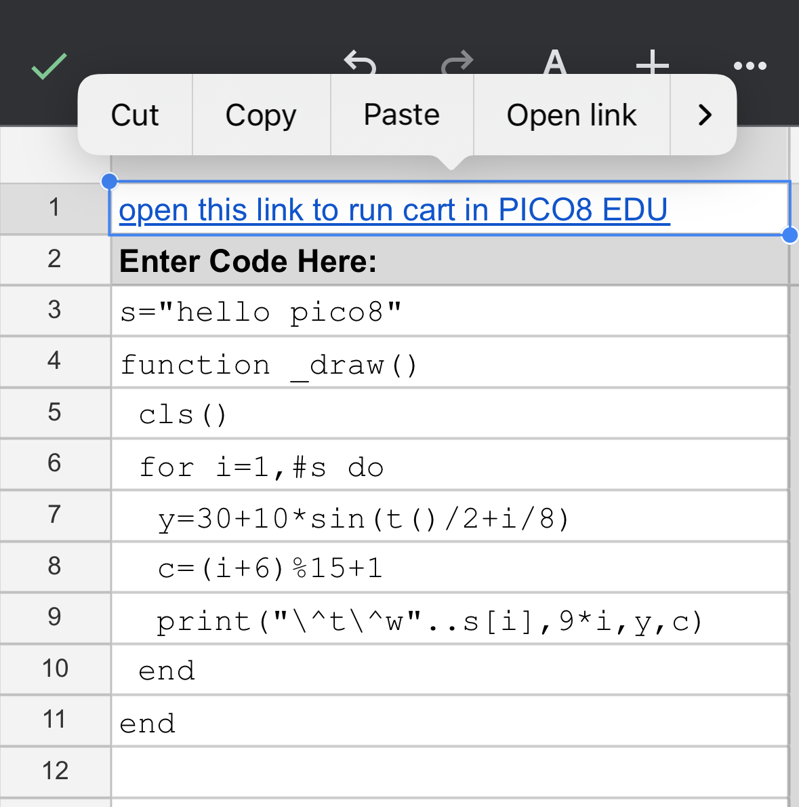
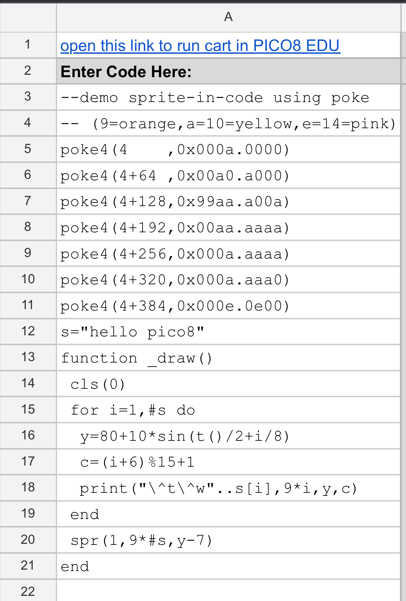
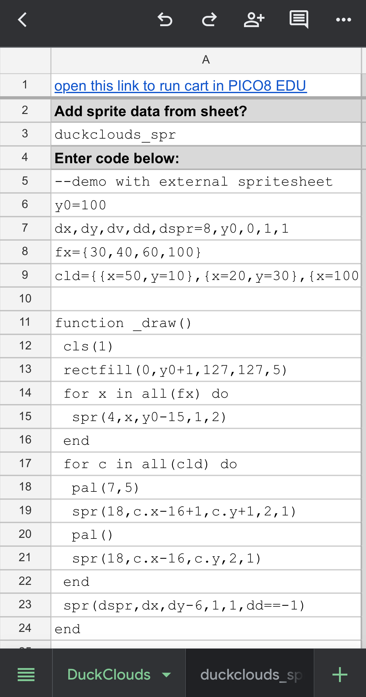

# SpreadSheet UI for PICO-8 Education Edition

A way to create simple games / animations in PICO-8 on your phone, using... a spreadsheet as the IDE?


I built this strange solution to an extremely niche problem for myself, but figured I might as well share it for the handful of other people it would be interesting to. Everything below assumes you're already experienced with PICO-8 development.

Do you enjoy [PICO-8](https://www.lexaloffle.com/pico-8.php), a cozy 'fantasy console' you can use to make 128-pixel games and art? But do you wish you had a way to create and edit programs on mobile, for example while waiting in line or on the train?

While it's easy to play PICO8 games on mobile, development is tricky-- there's no Android/iOS app, and the free [web-based PICO-8 Education Edition](https://www.lexaloffle.com/bbs/?tid=47278) doesn't easily let you edit without a keyboard and mouse. People in the community have figured out workarounds like pairing a bluetooth keyboard (not something I carry), or some sort of remote desktop connection to PICO8 running on a computer at home... so here's a differently-hacky solution.

If you make a personal copy of the below Google spreadsheet, open it in the Google Sheets app on your phone, and edit code (and a few sprites), a collection of formulas will then translate your work into a URL that you can click to run in the web-based PICO-8 Education Edition.

> **https://docs.google.com/spreadsheets/d/1JBYUvbf5msDZphZl6bWZO7ellLLxmVQWjK5klt6JrBY/**

There are various limitations, read on for more details.

 *(this page is a long text dump, jotted down in an evening-- check the 'table of contents' icon in the upper right to jump between sections)*
 
## Quickstart

Open the (read-only) spreadsheet and make your own copy of it (you need a Google account, and I recommend using the Google Sheets app on your phone rather than trying to use it in a mobile browser...)

Write code in the "code" tab:


Click the link to run the code on the web-based PICO8 Education Edition! You may need to click twice: once to bring up the context menu with the "Open link" option:



## Sprites via POKE()

What if you want to add sprites?

One method is to remember that key PICO8 data in the official IDE (sprites, map, sound, and so on) are mapped to specific memory locations (see "Base RAM Memory Layout" in the manual). This is the method some text-only 'tweetcarts' (or whatever we're calling them these days) take advantage of to create sprites.

For example, these commands set pixel values in the memory location corresponding to sprite 1. I use this particular format of POKE4() because if you squint you can visualize the sprite from the hex values (caveat: byte pairs and pixels are swapped, so the sprite is horizontally flipped from what you might expect):



This lets you use a call to spr() to draw it to the screen.


## Spreadsheet Sprite Editor?

But wait, there's more... I added a template so you can also 'draw' a sprite by entering color values 0-15. Through the magic of conditional formatting these will even be highlighted with PICO8 color values as you go:


The newest version of the code tab lets you specify a spreadsheet tab to load sprite data from, and voila, a tiny program using the above sprites, written with my thumbs on mobile:



As with everything in this project, I had to make compromises. The URL format has a strict size limit, and I haven't taken the time to decipher the compression the official tools use, so including this sprite data in the URL significantly reduces how much code you'll have space for. I set up this template to use just 8 specific sprites (#1-#4, #17-#20) to save space, and if you don't enter a spritesheet name in the code tab it won't encode sprite data at all, freeing up more room for code.

You can look at all the spreadsheet formulas and customize this to your liking, though.

## Map, Sound

While it would be amusing to add spreadsheet-based map and sfx/music editors, I don't believe those are supported in the "URL format" for short PICO8 EE carts (technically, map data could be supported in lower spritesheet memory, but when I built a prototype this consumed too much of the URL for little benefit). Additionally, I expect carts written to fit the limited number of characters in the URL format are unlikely to use map or sfx much.

Instead, you can generate them in code-- using MSET or POKE to generate a map, and POKE or the P8SCII shortcode `?"\a..."` to play audio.

For details, see the PICO8 manual and BBS, but for example:

``` lua
--generate map with random walls, grass, apples
for i=1,80 do
  mset(rnd(mapsz),rnd(mapsz),1)
  if (rnd()<0.5) mset(rnd(mapsz),rnd(mapsz),3)
  if (rnd()<0.2) mset(rnd(mapsz),rnd(mapsz),2)
end
--[...]
--draw map, camera pans as you move
camera(camx,camy)
map(mx,my)
--[...]
--collect apple
if mget(tx,ty)==2 then
  mset(tx,ty,0)
  s+=1
  ?"\as8ceg" --play sound
end
```

The sample program "DuckWorld" in the spreadsheet uses all of these to make a little scrolling world for a duck to explore and eat apples:


## Security

It's good to be cautious about opening / running arbitrary programs. And--

* This spreadsheet does not contain any scripts, just formulas
* It does not prompt you for any permissions-- it's self-contained and doesn't have or need access to your files or external resources (well, other than existing in the cloud like any google document)-- it just translates the code you write in it into a URL to the PICO8 Education Edition site
* You can look under the hood at what the (relatively simple) formulas do to generate that URL and check that the generated URL points at the https://www.pico-8-edu.com/ domain before clicking on it, if you want.

## Tips & Tricks

* By using the Google Sheets app as the 'editor', you get access to all its UI features, some of which happen to be useful for the types of editing we want to do. These may vary across platforms and will change over time, but explore where you can tap, long-press, and so on (on cells, borders, row labels on the left, icons on the bottom), which provide various shortcuts to let you copy, paste, quickly insert and delete rows, zoom out to see more of a spritesheet, and so on... 


Using Sheets as the frontend also gives you undo, a basic revision history in case you mess something up, syncing of work across devices, the ability to change fonts and formatting, and so on.

* Autocorrect and other "helpful" writing features may be annoying. Since PICO-8 is normally case-sensitive, behind the scenes the spreadsheet converts any code you write to lowercase before generating a cart link. This prevents you from using uppercase unless you edit the spreadsheet, but that was worth it for me.

  * If you're finding autocorrect trips you up, you could always disable it while using this

* Look carefully at your keyboard-- at least in the current iOS version of Google Sheets, a little bar with commonly-used math symbols and parentheses appears above your keyboard even when in alphabet mode, which can save you a few clicks. And some phones provide customizable keyboards.

## Limitations / Known Issues

This is a fun hack, but I'd almost never choose it over working at a computer with keyboard if I have one, for a few reasons:

* As with many systems build on spreadsheets, this will be brittle to changes such as moving critical cells or inserting new rows in a few specific locations (for example, the 'spritesheet' functionality assumes a specific # of sprites in a specific location on the template sheet). I've tried to minimize that sensitivity by using as few intermediate value cells as possible and placing them in locations that would be unlikely to be disturbed, but things can break... at least you can always undo or go back in a sheet's version history.

* This will only support relatively small programs (due to the 2000 character PICO8 @URL limit?), I see it as mostly useful for doodling, throwaway animations, tweetcarts, or working on some function / subroutine for a bigger project if you have a flash of inspiration while away from home.

* The P8 @URL format or Sheets UI could change at any time, breaking this
  * At least I'm not trying to write a PICO-8 interpreter or emulator, which would break every time there's an update to PICO8-- this is just translating the code to a string PICO-8 itself will unpack and interpret.

* I intended to support the extended PICO8 character set (e.g. symbols from 128 and up: cat face, arrows, hiragana, and so on) with a lookup table, but my initial formula approach breaks on double-width characters. It's certainly solvable, but given that it would be difficult to enter these extended characters in the first place (as they're not on the default mobile soft keyboard), I decided not to try to support them for now. This would be a bigger limitation if this were a tool for editing existing carts-- but given the size limitations it's mostly for blank page prototyping where it's easy enough to write `btnp(1)` instead of `btnp(⬅️)`.

* Phone keyboard autocorrect / autocomplete can make some undesired swaps that require manual fixing (I only use this occasionally so haven't resorted to disabling autocomplete). For example, on my device it sometimes replaces two dashes (the comment prefix) with an emdash (unrecognized character). I've considered adding a custom search-and-replace pass on the code to reverse things like that where intent is clear, but it's low priority.

* For now, I also automatically convert the input to lowercase before processing it, since that's what you'd almost always want to use in PICO8.

* As mentioned earlier-- I see that PICO-8 applies some form of compression before saving to @URL format. I didn't have time to figure out what it's doing and took a simpler uncompressed route, which further limits how large a program this spreadsheet can encode.

* I've only tested this on the iOS Sheets app, I don't recall how similar or different the Android Sheets UI is.

## Development Notes

### Release Notes

* **v0.5, 2025-03-21**: Arbitrary numbering for this first version I'm sharing with other people.

I expect I'll hear a range of ideas or people will build their own improved versions, in which case I'll link to them from here.

### Motivation

I bought PICO-8 years ago and occasionally use it as the equivalent of 'doodling in a sketchbook'-- spending an hour or two on a rainy day making some one-off interactive animation or game. Back when I was on twitter, I'd occasionally join the "tweetcart" community or game jams, focused on building some toy application or game in 560 or fewer characters, and it's impressive what is possible. When I'm waiting in a long line or on a bus, what if rather than scrolling news and social media on my phone I could be writing little one-off animations? That's relatively challenging to do on a phone, though.

I'm not a software engineer professionally, and I certainly don't have the free time or knowledge to build a custom PICO-8-exporting app, but... what if I could build on top of some existing third-party text editor app? 

I spent one evening poking around in the URL format for Education Edition (which can save very short 2000-character-or-less applications in a text URL), and saw it's an almost-b64-encoded translation of the code and spritesheet contents, and though it would be an interesting challenge to build a b64 encoder in spreadsheet formulas without script, and here we are...

### Dev Observations

In the process of figuring out how the PICO8 URL format was generated, I noticed:

* By looking at how the encoded @URL changes if I change single characters or pixels in PICO8, there's some compression (some form of run-length encoding at least for sprite data-- most obvious if you have a row of pixels of the same color) applied to the code before b64 encoding. However, the P8 Edu Edition can accept uncompressed data in the URL as well, which is what I started with just to get something working quickly.

* I had this wrapper mostly working, but was seeing errors where '>' and '?' characters (CHRs 62 and 63) in code were sometimes (but not always) swapped when opening a cart link generated by this spreadsheet in Education Edition. Adding or removing whitespace in the cart seemed to make the problem go away?! Eventually I discoverd that PICO8's @URL format seems to swap the meaning of '-' and '_' in its b64 encoding compared to the typical urlsafe encoding. Those represent values 62 and 63, so we'd expect a common decoding issue when > or ? characters line up with three-character boundaries in the input data (we'd also see this for other combinations of characters but mostly less used extended characters). I don't know if this is some light obfuscation or was unintentional, but I've adjusted this wrapper to match what PICO8's URL format seems to expect.

### Google Sheets notes-to-self

It's possible to build a lot of functionality in spreadsheets, even without incorporating scripting (AppScript, VBA, etc). A few more modern spreadsheet functions have made that easier than it was years ago:

* `MAP()` and `LAMBDA()` are powerful and flexible alternatives to array formulas or having sheets of 'intermediate data' that later formulas process.

  * I haven't figured out if there's a cleaner way to split a string into an array of character values but this is fairly concise (assuming we can choose some character like "¶" we know isn't naturally in the input):

```
chararray = MAP(SPLIT(REGEXREPLACE(input,,"¶"),"¶"),lambda(x,CODE(x)))
```

* The `LET()` function in Google Sheets is very convenient for avoiding hard-to-read and error-prone copy and paste within formulas, avoiding the need for various 'intermediate value' dummy cells, and can be abused as a way to add quick comments within a formula. Why write:
```
mid("ABCDEFGHIJKLMNOPQRSTUVWXYZabcdefghijklmnopqrstuvwxyz0123456789_-",a,1) & 
mid("ABCDEFGHIJKLMNOPQRSTUVWXYZabcdefghijklmnopqrstuvwxyz0123456789_-",b,1) & 
mid("ABCDEFGHIJKLMNOPQRSTUVWXYZabcdefghijklmnopqrstuvwxyz0123456789_-",c,1) &
mid("ABCDEFGHIJKLMNOPQRSTUVWXYZabcdefghijklmnopqrstuvwxyz0123456789_-",d,1)
```
when you can write something like
```
let(b64map,let(comment,"b64 encoding: nonstandard with -,_ swapped",
    "ABCDEFGHIJKLMNOPQRSTUVWXYZabcdefghijklmnopqrstuvwxyz0123456789_-"),
mid(b64map,a,1) & mid(b64map,b,1) & mid(b64map,c,1) & mid(b64map,d,1))
```

* `QUERY()` is also very powerful + flexible in certain circumstances though I don't use it in this project.